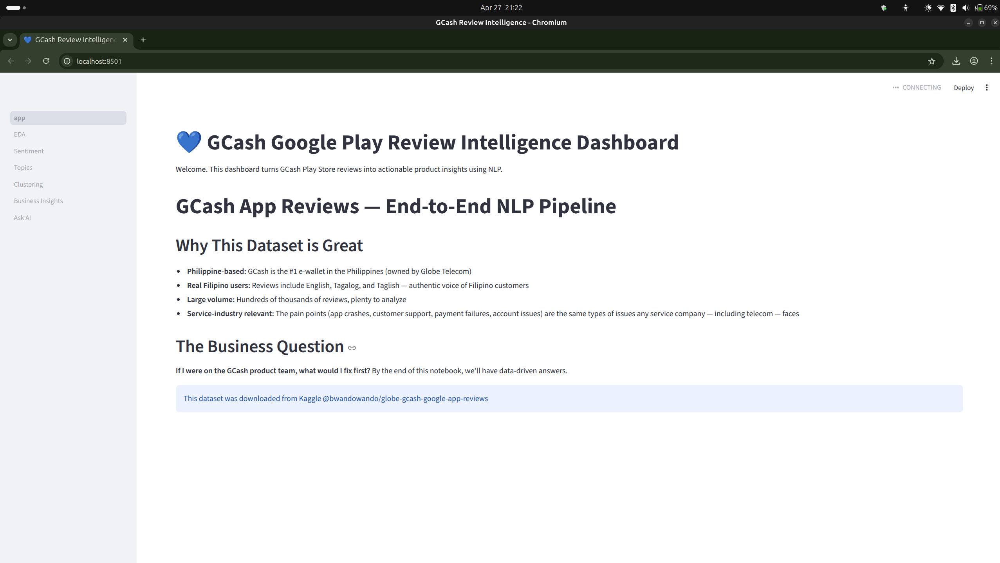
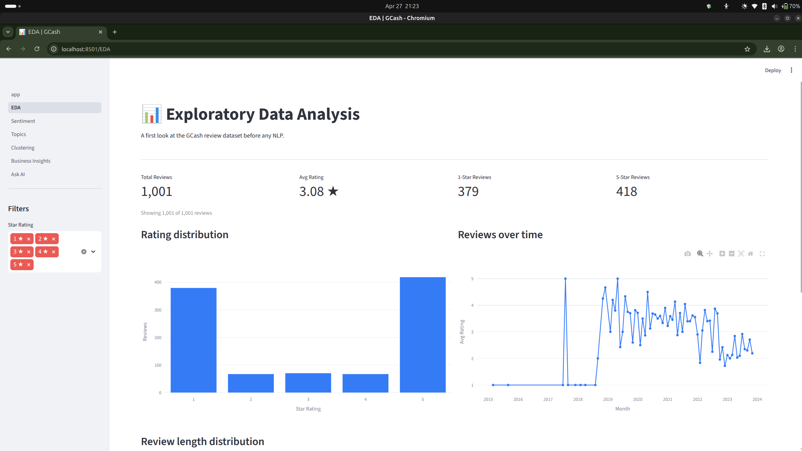
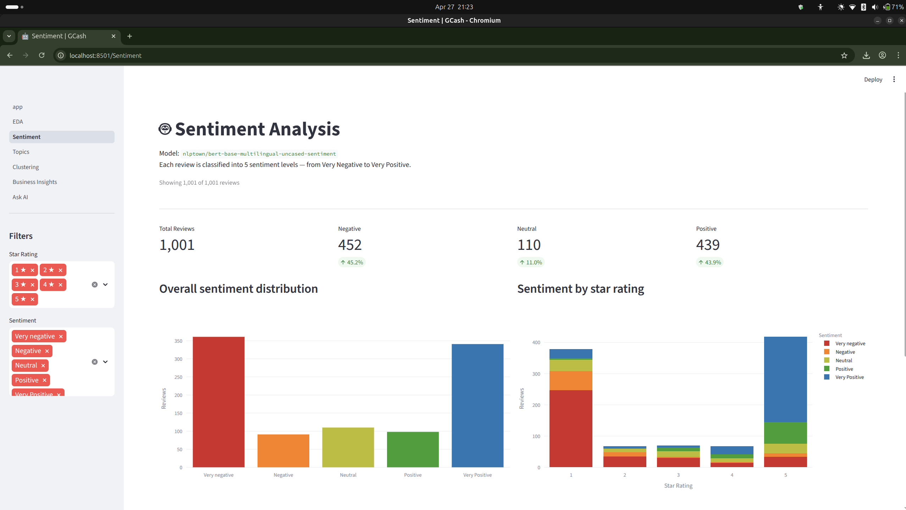
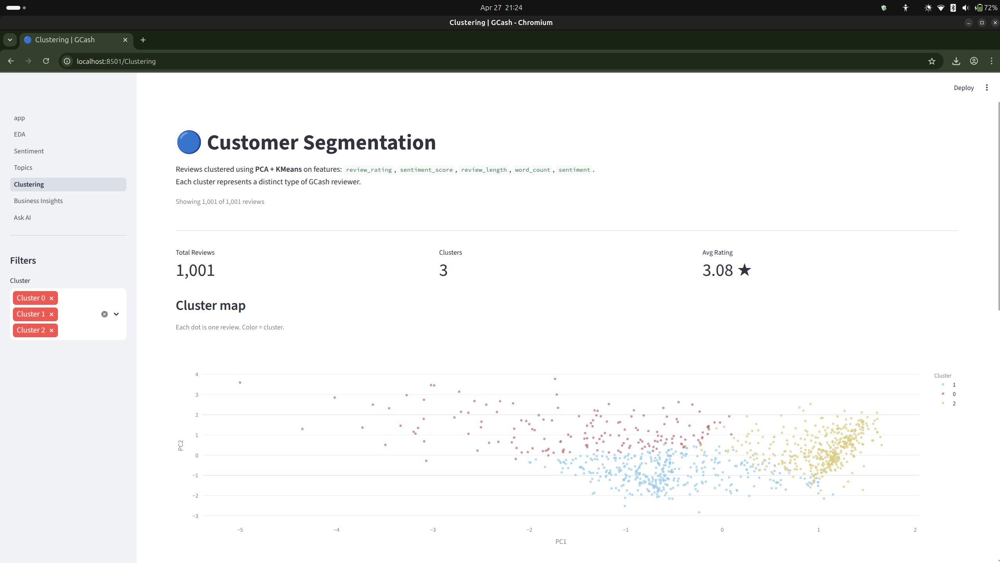
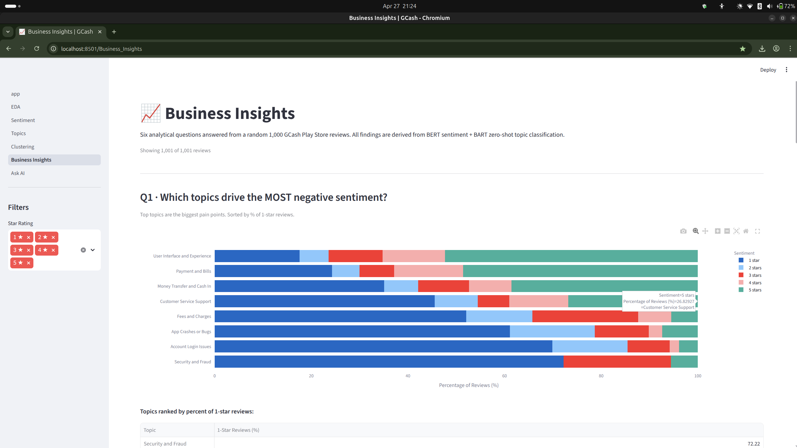
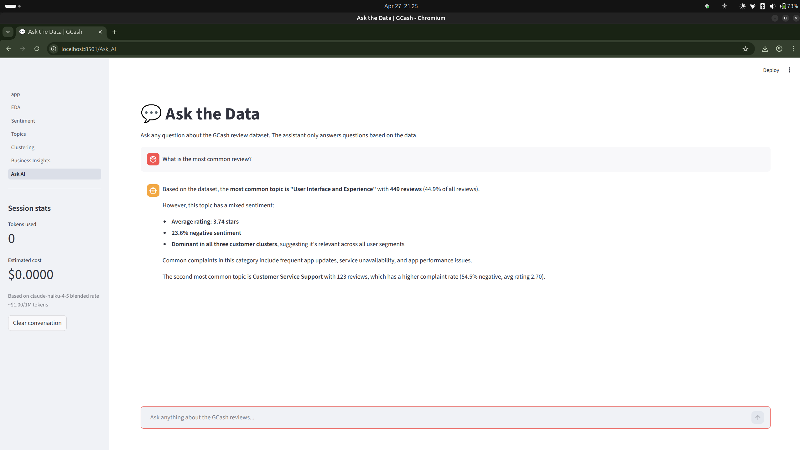

# GCash NLP Dashboard

> Turning 1,000 Google Play Store reviews into actionable product insights using NLP.

A multi-page Streamlit dashboard applying BERT sentiment analysis, zero-shot topic classification, and KMeans clustering to real GCash user reviews — with a built-in Claude AI analyst.

---

## Screenshots


<br>

<br>

<br>

---

## Pages

| Page | What it shows |
|---|---|
| EDA | Rating distribution, monthly trends, review length |
| Sentiment | BERT sentiment across 5 levels by star rating |
| Topics | 8 zero-shot business topics with sentiment mix |
| Clustering | PCA + KMeans segments with cluster profiles |
| Business Insights | Six analytical questions with charts |
| Ask the Data | Claude-powered natural language chat |

---

## NLP Pipeline

- **Sentiment** — `nlptown/bert-base-multilingual-uncased-sentiment` (5-level, multilingual)
- **Topics** — `facebook/bart-large-mnli` zero-shot across 8 GCash-specific categories
- **Clustering** — PCA (2 components) + KMeans on rating, sentiment, length, word count
- **AI Chat** — `claude-haiku-4-5` with a precomputed ~800-token data summary as context

---

## Running Locally

```bash
git clone https://github.com/airishchristian/gcash-nlp-dashboard.git
cd gcash-nlp-dashboard
uv sync
echo "ANTHROPIC_API_KEY=your_key_here" > .env
cp /path/to/gcash_reviews_enriched.csv data/
uv run streamlit run app.py
```

The enriched dataset is not committed. Run `01_eda.ipynb` to produce it.

---

## Deployment

Deployed on [Streamlit Community Cloud](https://streamlit.io/cloud). Add your API key under **Settings → Secrets**:

```toml
ANTHROPIC_API_KEY = "your_key_here"
```

---

## Tech Stack

Streamlit · Plotly · pandas · Hugging Face Transformers · scikit-learn · Anthropic API · uv

---

## Author

Built by **Airish Christian P. Tabay** — [linkedin.com/in/airishchristian](#) · [github.com/airishchristian](#)